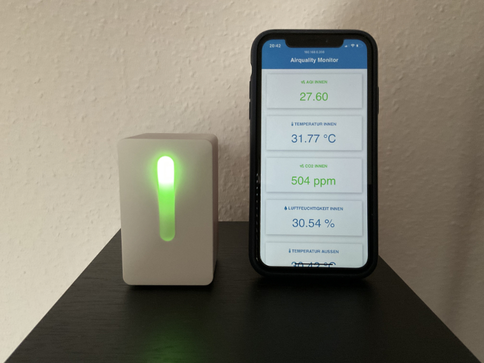
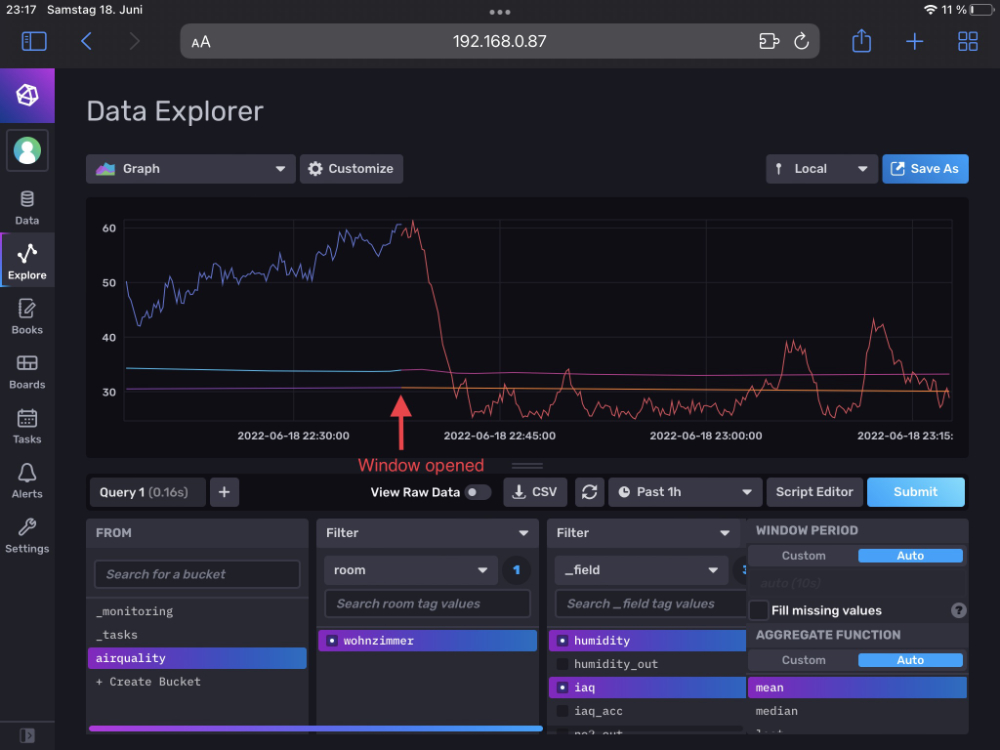

# ESP32 Airquality Monitor
An indoor air quality monitor based on the ESP32 and using a Bosch BME688 gas sensor.

This project can be used to hack the IKEA "VINDRIKTNING" air quality sensor to make it smarter:

The data can be pushed directly via MQTT to InfluxDB and analysed later or just visualized:

## Installation

Please refer to my article on Medium: coming soon...

## Usage

The device can be controlled either by the built-in web interface or by RS232 serial commands via screen (macOS/Linux) or the Arduino Serial Monitor.

List of available serial commands:

* SET_WIFI_CREDETIALS SSID,Password
* SET_MQTT_CONNECTION IP,Port
* SET_MQTT_CREDENTIALS Clientname,Username,Password
* SET_MQTT_SEND_TOPIC Topic
* SET_OWM_KEY abcdefg
* SET_OWM_LON_LAT longitude,latitude
* SET_ROOM_NAME room
* SET_TEMP_OFFSET offset
* TOGGLE_WIFI
* TOGGLE_MQTT
* TOGGLE_OWM
* TOGGLE_LEDS
* TOGGLE_BSEC_SERIAL_LOG
* TOGGLE_VENT_STATE
* SET_BRIGHTNESS 40
    * *Note: Values 40-255 allowed*
* SET_DEVICENAME NeuerName
    * *Note: This will set the WiFi DNS name -> http://devicename.local*
* SET_DEBUGMODE
* VERSION
* SET_DEFAULTS
* GET_SERIAL
* GET_MEM_USAGE
* GET_CONFIG
* IMPORT_CONFIG val1,val2,val3,...
